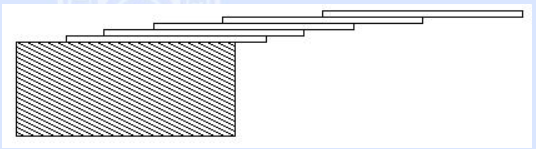

# 第一章 简单计算编程
目的：掌握C++基本语法格式

#### 目录

- [1.牛刀小试：计算平均工资](#计算平均工资)
- [2.牛刀小试：多测试用例](#多测试用例)
- [3.牛刀小试：素数](#素数)
- [4.牛刀小试：对实数取整](#对实数取整)
- [5.牛刀小试：二分法数据查找](#二分法数据查找)
- [6.牛刀小试：二分法求函数值](#二分法求函数值)

#### 计算平均工资

- 题目描述：

```
Description
Larry graduated this year and finally has a job. He's making a lot of money, but somehow  never seems to have enough. Larry has decided that he needs to grab hold of his financial  portfolio and solve his financing problems. The first step is to figure out what's been   going on with his money. Larry has his bank account statements and wants to see how much  money he has. Help Larry by writing a program to take his closing balance from each of    the past twelve months and calculate his average account balance.

Input
The input will be twelve lines. Each line will contain the closing balance of his bank   account for a particular month. Each number will be positive and displayed to the penny.  No dollar sign will be included.

Output
The output will be a single number, the average (mean) of the closing balances for the   twelve months. It will be rounded to the nearest penny, preceded immediately by a dollar  sign, and followed by the end-of-line. There will be no other spaces or characters in   the output.

Sample Input
100.00
489.12
12454.12
1234.10
823.05
109.20
5.27
1542.25
839.18
83.99
1295.01
1.75

Sample Output
$1581.42
```

- 思路：

```
简单的输入-处理-输出模式，只要注意小数位和前面的单位即可
测试平台：北大POJ-1004
```

- C++实现：

```c++
#include<iostream>
#include <iomanip> 
using namespace std;
int main()
{
	float avg, sum = 0.0, a[12] = {0};	//定义
	int i;
	for(i = 0; i < 12; i++)
	{
		cin >> a[i];
		sum += a[i];
	}
	avg = sum/12;
	cout <<'$' << fixed << setprecision(2) << avg;
	return 0;
}
```

#### 多测试用例

- 题目描述：给定2~15个正整数，计算有多少对满足一个是另一个的两倍。

```
Description
As part of an arithmetic competency program, your students will be given randomly   generated lists of from 2 to 15 unique positive integers and asked to determine how many   items in each list are twice some other item in the same list. You will need a program   to help you with the grading. This program should be able to scan the lists and output   the correct answer for each one. For example, given the list   
1 4 3 2 9 7 18 22
your program should answer 3, as 2 is twice 1, 4 is twice 2, and 18 is twice 9. 

Input
The input will consist of one or more lists of numbers. There will be one list of numbers   per line. Each list will contain from 2 to 15 unique positive integers. No integer will   be larger than 99. Each line will be terminated with the integer 0, which is not   considered part of the list. A line with the single number -1 will mark the end of the   file. The example input below shows 3 separate lists. Some lists may not contain any   doubles.

Output
The output will consist of one line per input list, containing a count of the items that   are double some other item.  

Sample Input
1 4 3 2 9 7 18 22 0
2 4 8 10 0
7 5 11 13 1 3 0
-1

Sample Output
3
2
0
```

- 思路：

```
包含多测试用例。需要循环处理每个用例
1.通过一层循环读取当前测试用例的数组a
2.通过两层循环结构，判断是否满足一个是另一个两倍
测试平台：POJ-1552
```

- C++实现

```C++
#include<iostream>
using namespace std;

int main()
{
	int a[20];  //整型数组，存储测试用例
	cin >> a[0];
	while(a[0] != -1)	//整个输入的结束标志
	{
		int n = 1;
		for (;;n++)
		{
			cin >> a[n];
			if(a[n] == 0)
				break;	//单行测试用例的结束标志
		}
		
		int count = 0;	//当前测试用例中有多少对满足条件
		for(int i = 0; i < n-1; i++)
		{
			for(int j = i+1; j <n; j++)
			{
				if (a[i]*2 == a[j] || a[i] == a[j]*2)
					count++;	//满足条件，加1
			}
		}
		cout << count << endl;	//输出结果
		cin >> a[0];	//输入下一个测试用例
	}
	return 0;
}
```

#### 素数

- 题目描述：一些正整数可以表示为一个或多个连续的素数之和。给定一个正整数，有多少种表示形式呢？例如53可以表示为5+7+11+13+17和53两种。注意加法必须是连续的素数，例如20，用7+13是不行的！编写程序，给定一个正整数，给出-有多少种表示形式。

```
Description
Some positive integers can be represented by a sum of one or more consecutive prime   numbers. How many such representations does a given positive integer have? For example,   the integer 53 has two representations 5 + 7 + 11 + 13 + 17 and 53. The integer 41 has   three representations 2+3+5+7+11+13, 11+13+17, and 41. The integer 3 has only one   representation, which is 3. The integer 20 has no such representations. Note that   summands must be consecutive prime 
numbers, so neither 7 + 13 nor 3 + 5 + 5 + 7 is a valid representation for the integer   20. 
Your mission is to write a program that reports the number of representations for the   given positive integer.

Input
The input is a sequence of positive integers each in a separate line. The integers are   between 2 and 10 000, inclusive. The end of the input is indicated by a zero.  

Output
The output should be composed of lines each corresponding to an input line except the   last zero. An output line includes the number of representations for the input integer as   the sum of one or more consecutive prime numbers. No other characters should be   inserted in the output.

Sample Input
2
3
17
41
20
666
12
53
0

Sample Output
1
1
2
3
0
0
1
2
```

- 思路

```
测试用例在2~10000之间，因此我们可以先把[2,10001]之间的素数先算出来，存在数组中
在判断当前测试用例n时，可以采用双层循环：
1.外循环遍历所有比n小的素数
2.内循环计算素数连续的和cnt,当cnt==n时，ans+1
测试平台：POJ-2739
```

- C++代码

```c++
#include <iostream>
using namespace std;
const int maxp = 2000, n = 10000;  //设置素数表的长度和输入值的上限
int prime[maxp], total = 0;	//素数表和素数长度初始化
bool isprime(int k)
{
	for(int i = 0; i < total; i++)
	{
		if (k % prime[i] == 0)
			return false;	//不是素数
	}
	return true;
}

int main()
{
    for (int i = 2; i <= n; i++)	//建立素数表
	{
		if (isprime(i))
			prime[total++] = i;	
	}
	
	prime[total] = n+1;	//素数表构建完成
	int m;
	cin >> m; //输入第一个正数
	while(m)
	{
		int ans = 0;
		for(int i = 0; m >= prime[i]; i++)	//最小素数枚举
		{
			int cnt = 0; // 连续素数的和
			for(int j = i; j < total && cnt < m; j++)	//注意终止条件
			{
				cnt += prime[j];	//累加
			}
			if (cnt == m)
				++ans;
		}
		cout << ans << endl;
		cin >> m;
	}
	return 0;
}
```

#### 对实数取整

- 题目描述：一块土地，每年会流失50平方英里，以坐标原点向I,II象限以半圆的形式流失，根据坐标点确定多少年后，该点会流失。

```
Description
Fred Mapper is considering purchasing some land in Louisiana to build his house on. In  the process of investigating the land, he learned that the state of Louisiana is actually   shrinking by 50 square miles each year, due to erosion caused by the Mississippi River.   Since Fred is hoping to live in this house the rest of his life, he needs to know if   his land is going to be lost to erosion. 

After doing more research, Fred has learned that the land that is being lost forms a   semicircle. This semicircle is part of a circle centered at (0,0), with the line that   bisects the circle being the X axis. Locations below the X axis are in the water. The   semicircle has an area of 0 at the beginning of year 1. 

Input
The first line of input will be a positive integer indicating how many data sets will be   included (N). Each of the next N lines will contain the X and Y Cartesian coordinates   of the land Fred is considering. These will be floating point numbers measured in miles.   The Y coordinate will be non-negative. (0,0) will not be given.

Output
For each data set, a single line of output should appear. This line should take the form   of: “Property N: This property will begin eroding in year Z.” Where N is the data set   (counting from 1), and Z is the first year (start from 1) this property will be within   the semicircle AT THE END OF YEAR Z. Z must be an integer. After the last data set, this   should print out “END OF OUTPUT.”

Sample Input
2
1.0 1.0
25.0 0.0

Sample Output
Property 1: This property will begin eroding in year 1.
Property 2: This property will begin eroding in year 20.
END OF OUTPUT.
Hint
1.No property will appear exactly on the semicircle boundary: it will either be inside or   outside. 
2.This problem will be judged automatically. Your answer must match exactly, including   the capitalization, punctuation, and white-space. This includes the periods at the ends   of the lines. 
3.All locations are given in miles.
```

- 思路

```
测试用例的个数事先已知，可以通过for循环进行遍历
第i个测试用例(Xi,Yi)与圆心(0,0)构成的半圆即为流失的土地
因为年份为整数，因此(Xi,Yi)流失的年份应该是大于(半圆面积/50)的最小整数
向上取整ceil(x),向下取整floor(x)
测试平台：POJ-1005
```

- C++实现

```c++
#include <iostream>
#include <cmath>
#define MPI 3.14159265
using namespace std;
int main()
{
	int num_props;	//测试用例个数
	cin >> num_props;
	
	float x,y;	//坐标，单精度实数
	double calc;	// 半圆面积/50
	int years;  //失去土地的年份
	for(int i = 1; i <= num_props; i++)
	{
		cin >> x >> y;
		calc = (x*x + y*y) * MPI / 2 / 50;	
		years = ceil(calc); // 向上取整
		cout << "Property " << i << ": This property will begin eroding in year "<< years <<".\n";
	}
	cout << "END OF OUTPUT.\n" <<endl;
	return 0;
}
```

#### 二分法数据查找

- 题目描述：一叠卡片向桌子外延伸，一张卡片延伸1/2,两张延伸1/2+1/3,n张延伸1/2 + 1/3 +...+1/(n+1),给定一个长度(最小0.01，最大5.20)，问最少需要多少张卡片？

  

```
Description
How far can you make a stack of cards overhang a table? If you have one card, you can   create a maximum overhang of half a card length. (We're assuming that the cards must be   perpendicular to the table.) With two cards you can make the top card overhang the bottom   one by half a card length, and the bottom one overhang the table by a third of a card   length, for a total maximum overhang of 1/2 + 1/3 = 5/6 card lengths. In general you can   make n cards overhang by 1/2 + 1/3 + 1/4 + ... + 1/(n + 1) card lengths, where the top   card overhangs the second by 1/2, the second overhangs tha third by 1/3, the third   overhangs the fourth by 1/4, etc., and the bottom card overhangs the table by 1/(n + 1).   This is illustrated in the figure below.

Input
The input consists of one or more test cases, followed by a line containing the number   0.00 that signals the end of the input. Each test case is a single line containing a   positive floating-point number c whose value is at least 0.01 and at most 5.20; c will   contain exactly three digits.

Output
For each test case, output the minimum number of cards necessary to achieve an overhang   of at least c card lengths. Use the exact output format shown in the examples.  

Sample Input
1.00
3.71
0.04
5.19
0.0
Sample Output
3 card(s)
61 card(s)
1 card(s)
273 card(s)
```

- 思路

```
1.数据长度的范围给定，因此可以先离线计算出延伸长度不超过5.20需要的卡片数组len[n]。
2.延伸的长度是实数，因此需要注意计算的精度
3.卡片长度数组len是递增数组，因此在给定一个延伸长度时，可以通过二分查找的方法来快速确定所需的卡片数
```

- C++代码

```c++
#include <iostream>
using namespace std;
const int maxn = 300;	//卡片数组的最大长度
const double delta = 1e-8;	//精度

int zero(double x)	//精度判断函数，返回值1,-1,0
{
	if (x < -delta)
		return -1;
	return x > delta;
}

int main()
{
	double len[maxn];	//长度数组
	int total;	//数组实际长度
	len[0] = 0.0;	
	for (total = 1; zero(len[total-1] - 5.20) < 0; total++)	//构建卡片数组
		len[total] = len[total-1] + 1.0/double(total + 1);
	double x;	
	cin >> x;
	while(x)
	{
		int left = 0, right = total;	//二分查找
		while(left + 1 < right)
		{
			int mid = (left + right) / 2;
			if(zero(len[mid]-x)<0)
				left = mid;
			else
				right = mid;
		}
		cout << right << " card(s)" << endl;
		cin >> x;
	}
	return 0;
}
```

#### 二分法求函数值

- 题目描述：相关量的计算，例如z = f(x,y), 给定任意其中两个，求取第三个量，结果输出x,y,z。

```
Description
Adapted from Wikipedia, the free encyclopedia
The humidex is a measurement used by Canadian meteorologists to reflect the combined   effect of heat and humidity. It differs from the heat index used in the United States in   using dew point rather than relative humidity.
When the temperature is 30°C (86°F) and the dew point is 15°C (59°F), the humidex is 34   (note that humidex is a dimensionless number, but that the number indicates an   approximate temperature in C). If the temperature remains 30°C and the dew point rises to  25°C (77°F), the humidex rises to 42.3.
The humidex tends to be higher than the U.S. heat index at equal temperature and relative   humidity.
The current formula for determining the humidex was developed by J.M. Masterton and F.A.   Richardson of Canada's Atmospheric Environment Service in 1979.
According to the Meteorological Service of Canada, a humidex of at least 40 causes "great   discomfort" and above 45 is "dangerous." When the humidex hits 54, heat stroke is   imminent.
The record humidex in Canada occurred on June 20, 1953, when Windsor, Ontario hit 52.1.   (The residents of Windsor would not have known this at the time, since the humidex had   yet to be invented.) More recently, the humidex reached 50 on July 14, 1995 in both   Windsor and Toronto.
The humidex formula is as follows:
humidex(湿热指数) = temperature(温度) + h
h = (0.5555)× (e - 10.0)
e = 6.11 × exp [5417.7530 × ((1/273.16) - (1/(dewpoint(露点)+273.16)))]
where exp(x) is 2.718281828 raised to the exponent x.
While humidex is just a number, radio announcers often announce it as if it were the   temperature, e.g. "It's 47 degrees out there ... [pause] .. with the humidex,". Sometimes   weather reports give the temperature and dewpoint, or the temperature and humidex, but   rarely do they report all three measurements. Write a program that, given any two of   the measurements, will calculate the third.
You may assume that for all inputs, the temperature, dewpoint, and humidex are all   between -100°C and 100°C.

Input
Input will consist of a number of lines. Each line except the last will consist of four   items separated by spaces: a letter, a number, a second letter, and a second number. Each   letter specifies the meaning of the number that follows it, and will be either T,   indicating temperature, D, indicating dewpoint, or H, indicating humidex. The last line   of input will consist of the single letter E.

Output
For each line of input except the last, produce one line of output. Each line of output   should have the form:
T number D number H number
where the three numbers are replaced with the temperature, dewpoint, and humidex. Each   value should be expressed rounded to the nearest tenth of a degree, with exactly one   digit after the decimal point. All temperatures are in degrees celsius.  

Sample Input
T 30 D 15
T 30.0 D 25.0
E

Sample Output
T 30.0 D 15.0 H 34.0
T 30.0 D 25.0 H 42.3
```

- 思路

```
1.仔细观察公式，发现当知道露点和另一个变量时，求取另外一个值会比较容易，只需要通过露点计算出h,则可以通过  
		湿热指数 = 温度 + h
  求取任意需要的值
2.难点在于当不知道露点时，求取露点比较麻烦。好在我们知道露点的范围，那么就可以用二分法的思想去逼近正确的露  点。不难发现，露点与h是正相关的，因此可设置露点初值为0，通过循环判断湿热指数是否大于预报指数，如果大于，则  露点减小一个增量，使湿热指数逼近预报，否则增大露点一个增量。
```

- C++代码

```c++
#include <iostream>
#include <math.h>
#include <iomanip>
using namespace std;

double temp, hum, dew;  //温度，湿度，露点

//根据温度tt,露点dd计算湿度hh
double dohum(double tt, double dd)
{
	double e = 6.11 * exp(5417.7530 * ((1/273.16) - (1/(dd + 273.16))));
	double h = 0.5555 * (e - 10.0);
	return tt + h;
}

//根据湿度hh和露点dd计算温度tt
double dotemp(double hh, double dd)
{
	double e = 6.11 * exp(5417.7530 * ((1/273.16) - (1/(dd + 273.16))));
	double h = 0.5555 * (e - 10.0);
	return hh - h;
}

//根据温度tt和湿度hh计算露点dd
double dodew(double tt, double hh)
{
	double x; //露点的临时值
	double delta = 100;		//露点增量
	for(delta; delta > 0.00001; delta *= 0.5)	//每次衰减50%
	{
		if (dohum(tt, x) > hh)
			x -= delta;
		else
			x += delta;
	}
	return x;
}

int main()
{
	char a,b;	//字母
	double A,B;	//实际值
	
	cin >> a;
	while (a != 'E')
	{
		cin >> A >> b >> B;
		temp = hum = dew = -99999;	//先赋初值，便于接下来的判断
		
		if(a == 'T') temp = A;	//判断A代表的是什么数据
		if(a == 'H') hum = A;
		if(a == 'D') dew = A;
		
		if(b == 'T') temp = B;	//判断B代表的是什么数据
		if(b == 'H') hum = B;
		if(b == 'D') dew = B;
		
		if(temp == -99999) temp = dotemp(hum, dew);	//缺温度补温度
		if(hum == -99999) hum = dohum(temp, dew);
		if(dew == -99999) dew = dodew(temp, hum);
		
		cout << "T " << fixed<< setprecision(1) << temp
		     << " D " << fixed<< setprecision(1) << dew
			 << " H " << fixed<< setprecision(1) << hum << endl;
		
		cin >> a;	//下一行输入
	}
	
	return 0;
}
```


